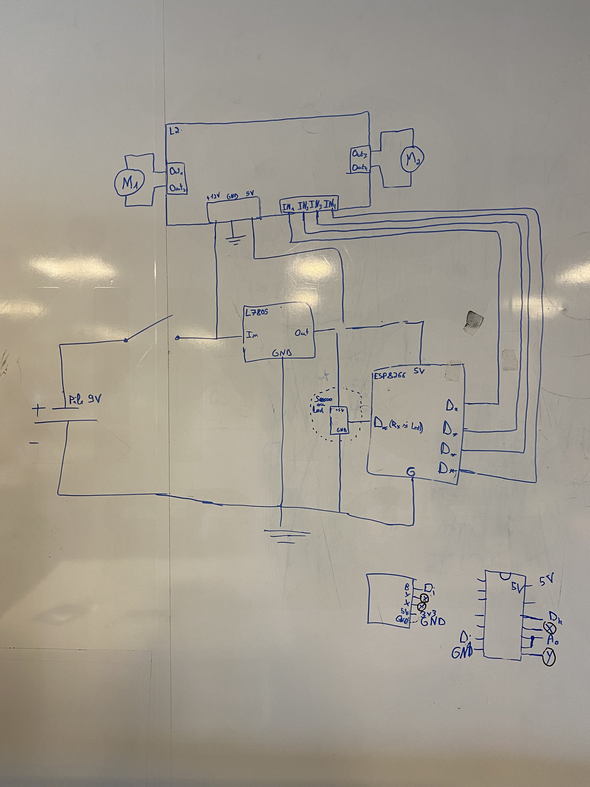

# 🚘Cyb3rtr1ck project

## 🪛About the project
This is a car designed to for the future of mankind. It is extremely resistant to **everything**, even you🫵.  
 Made by :   
![Antoine][Antoine.cc]   
 ![Corentin][Corentin.cc]
## 🦾Built with
[![Arduino][Arduino.cc]][Arduino-url]
## 👣Getting started
To start making the car,  you will need several things.
### 📃Prerequisite
First, here is a list of the main components you will need to acquire :
* x2 [ESP8266](https://www.amazon.fr/ESP8266-ESP-12F-D%C3%A9veloppement-NodeMCU-Compatible/dp/B093G72SHN/ref=sr_1_9?dib=eyJ2IjoiMSJ9.YQX2ZC-7ArE__8t9lEkImfeOFQlYW9eR_XyTZMPGCydiMPJwFo3SH0q-W_OFCQVaprBaSgDgKUFxiD5nIVrr0IW19PVJFc_z57plBFBfBoV3HlBrnDa3Q6lioYCwLwiRWXQX80fjCXf8CUyLkz-3upz11ng5gtnv0pGEZXcWmNKQMx-EA08kAbi9U8pXfaJ0V6Ex86LzvyrJIOS2v5PLTjFltLwQ4vC14ntNHFdAaefURVhJp7JbfYM552nLaF_tlNEuJ1JF3BeTkcBYuGTSM_XfV1aNdN-g9t7jZFVkHNA.qCq0N1dXJ9OmZ2acd5-Qqt2cb141rRNyPm0DflF4T6M&dib_tag=se&keywords=ESP8266&qid=1712824245&sr=8-9)(the link is already 2 pieces)
* x1 [joystick](https://www.amazon.fr/AZDelivery-Module-joystick-Arduino-gratuit/dp/B07V3HQSVY?th=1)
* x1 [electrical motor](https://fr.aliexpress.com/item/1005005016612156.html?spm=a2g0o.productlist.main.5.73d012016IDG91&algo_pvid=0ec19e4d-8114-4067-838b-e0b8d7f2a974&algo_exp_id=0ec19e4d-8114-4067-838b-e0b8d7f2a974-2&pdp_npi=4%40dis%21EUR%210.72%210.53%21%21%210.76%210.56%21%402103847817128248219031199ecfb0%2112000031353632363%21sea%21FR%210%21AB&curPageLogUid=yBVCkdcyI8l4&utparam-url=scene%3Asearch%7Cquery_from%3A)
* x1 [Servo motor](https://boutique.semageek.com/fr/104-micro-servo-tower-pro-sg90-3007447379574.html)
* x1 [Puce L298N](https://www.amazon.fr/DollaTek-Module-Stepper-Controller-Arduino/dp/B07DK6Q8F9/ref=sr_1_6?dib=eyJ2IjoiMSJ9.bbka0d3gULnVv_08qK2TNYG6mXheMWZvHc6yGhiawhCyNDyrXZ0UIkoEfPWF20TBiD2NMPWoqOECFGLTwSAdZlEcqj8qCVBRrtSXaw2nKCefJkhw_0vxf1v9YRUkh-dQGezHdoPX4m7D86P6YH8FdJCEEzsfcghPlWdfe7c5RhhJAWHp_S-b8oYU1R-UJd6fE9hfsqp3Xzu-kfgeHVCWEnV1MKVDAlBIJA7d6Dtegb5py2pj84tq7eEXTUkFuQh7ZhOs6phgVE3rID_9T7XQDvfriLVVyshp93JloqFJQG4.gKqPGgYsC57fyExyCZJUWkhHqT8OTa938R4jg9srlG0&dib_tag=se&keywords=L298+Motor+Driver&qid=1712842776&sr=8-6)
* x1 [battery](https://www.amazon.fr/Amazon-Basics-Piles-alcalines-quotidien/dp/B0774D64LT/ref=sr_1_58?dib=eyJ2IjoiMSJ9.FcGRIe3FBn9T7C-MzWzqw1cr1f64NkpGXRfiXaa9ippomYrpwhtwTYhRQHCVfpRNlZzhpmusfkDpff122qqyHdS3JWkMhtYd3AkDYHdx-XWXGGpkdAsB_k3fip7x13W5nUAxnmJ0_e9XoJXkTqI9tNfO4L4kA_lR8fzLZHb5uAYA-_z9G1HzGuSVsv8TgvAtnfK1dRscU8sLrmgeipDhLxMhkP43b_Phjsk9hzs2EwmjpNSAYwuhjS8Vzwba3x08V5cm45P3vvcJtMfg84VHAIktlkMACXPrkSgRp6mH-mI.-1DrbZMLZrOQ68kjcU6629RVSZKk6XEZG4Tcx5gl23w&dib_tag=se&keywords=pile+6v&qid=1712843659&refinements=p_76%3A437879031&rps=1&sr=8-58)  

You will also need to install the [Arduino IDE](https://www.arduino.cc/en/software) in order to compile and upload the code to the ESP.

## 🔧Instructions

### Software :
1. Launch the Arduino IDE and connect your ESP to your computer.  
Under `Files->Preferences` you will have to paste in `Additional Boards Manager URL` the following link :
```txt
http://arduino.esp8266.com/stable/package_esp8266com_index.json
```
2. In the right tab, open the Library Manager and install the following library :  
 `Servo by Michael Margolis`

3. Download the `.ino` files from the repository and open them with the Arduino IDE.  
Then, in the port selection, select the board `NodeMCU 0.9 (ESP-12)` along with the detected port.

4. In the different `.ino` files, replace the value of the pins to be the one you welded on the ESP, and replace the value inside the variable `broadcastAddress` with the MAC address of the ESP that will be in the car.  
Here is a [tutorial](https://randomnerdtutorials.com/get-change-esp32-esp8266-mac-address-arduino/) to get the MAC address of your ESP.
### Hardware

You will be able to find the printable pieces in the repository.  
Here is the circuit diagram


[Arduino.cc]: https://img.shields.io/badge/arduino-%2300878F?style=for-the-badge&logo=arduino
[Arduino-url]: https://www.arduino.cc/
[Antoine.cc]: https://img.shields.io/badge/Antoine-Vine-blue?style=flat
[Corentin.cc]: https://img.shields.io/badge/Corentin-Chrisment-blue?style=flat
